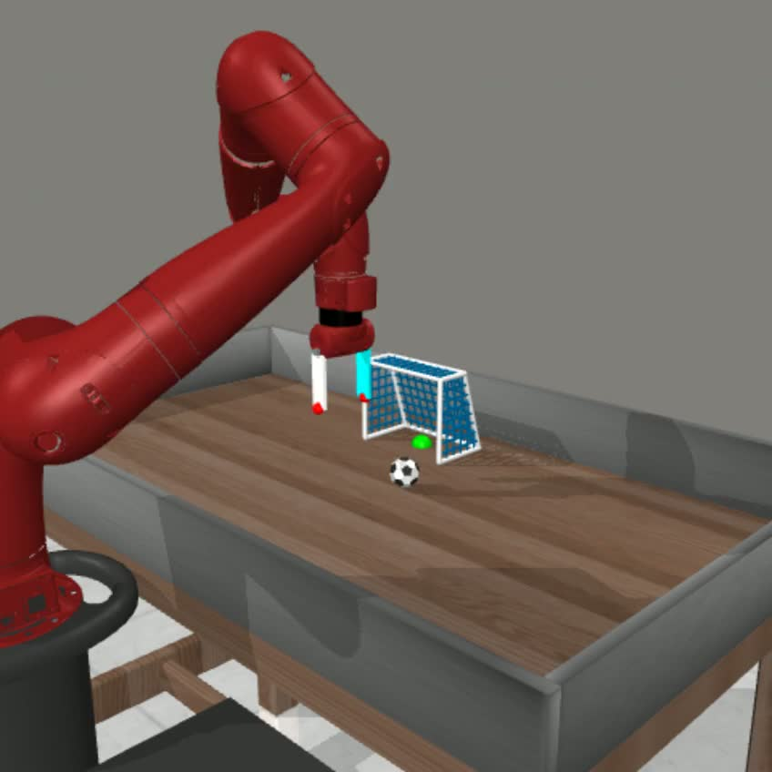

# MetaWorld-CLIP-BC-VLA

A lightweight **Vision-Language-Action (VLA)** baseline for MetaWorld robot-arm tasks using a pretrained **CLIP-ViT** vision transformer(**openai/clip-vit-base-patch32**), a small text transformer, and robot-state fusion—trained with behavior cloning and evaluated in a MetaWorld MT1 wrapper.

- **Vision**: pretrained **CLIP ViT** (transformer) as an image encoder  
- **Language**: small transformer encoder over token IDs  
- **Robot state**: fused with vision+language embeddings  
- **Policy head**: predicts continuous actions (MetaWorld-style)  

---

## Demo
<a href="https://youtu.be/7aWUy5V1rC0">
  
</a>

## Features

- ✅ Uses a pretrained **transformer vision encoder** (**openai/clip-vit-base-patch32**)
- ✅ Works with **MetaWorld MT1** tasks
- ✅ **Vision-Language-State → Action** fusion
- ✅ Minimal training code (BC with MSE + AdamW)
- ✅ Saves checkpoints compatible with the provided `test.py` rollout script

---

## Install dependencies
```bash
pip install -r requirements.txt
```

## Project Layout

1) Collect Demonstrations (soccer-v3)
This uses MetaWorld’s built-in expert policies (metaworld.policies) to generate demonstrations:

```bash
python3 collect_data.py \
--env-name soccer-v3 \
--camera-name corner \
--episodes 100 \
--max-steps 140 \
--output-path data/metaworld_soccer_bc.npz  \
--resize-to 480
```

2) Train the VLA policy
```bash
python3 train.py \
--data data/metaworld_soccer_bc.npz \
--out checkpoints/metaworld_soccer.pt \
--device cuda
```

3) Testing the model
```bash
python3 test.py \
--checkpoint checkpoints/metaworld_soccer.pt \
--env-name soccer-v3 \
--episodes 5 \
--max-steps 150 \
--instruction "Shoot the ball into the goal" \
--device cuda \
--save-video \
--video-dir videos
```

## Model Architecture (Layer-by-Layer)

A lightweight **Vision-Language-Action (VLA)** policy for MetaWorld trained with **Behavior Cloning (BC)**.

The model class is: `models/vla_clip_bc.py::VLAClipBC`

At a high level:

**(RGB image, instruction token IDs, robot state) → fused embedding → action**

---

## Overview

**Inputs**
- `img`: RGB image tensor `(B, 3, H, W)` in `[0, 1]`
- `text_ids`: token IDs `(B, T)` from `SimpleTokenizer` (padding id `0`)
- `state`: robot state vector `(B, S)`

**Outputs**
- `action`: continuous action `(B, A)` (optionally `tanh` squashed to `[-1, 1]`)

---

## Module Breakdown

### 1) Vision Branch (Pretrained CLIP ViT)

Implemented in `VLAClipBC.encode_vision()`:

1. **Preprocess**
   - Resize image to `224×224`  
     `F.interpolate(img, size=(224,224))`
   - Normalize with CLIP constants  
     `img = (img - clip_mean) / clip_std`

2. **CLIP Vision Transformer**
   - `self.vision = CLIPVisionModel.from_pretrained("openai/clip-vit-base-patch32")`
   - Uses `out.pooler_output` (shape `(B, 768)` for ViT-B/32)

3. **Projection to `d_model`**
   - `self.vision_proj = Linear(768 → D)`
   - Result: **vision embedding** `v` with shape `(B, D)`  
     (default `D = 512`)

**CLIPVisionModel (ViT-B/32) internals (high-level)**
- Patch embedding + class token + positional embeddings
- Transformer encoder stack (typical ViT-B/32)
  - ~12 transformer encoder layers
  - Each layer includes:
    - LayerNorm
    - Multi-Head Self-Attention
    - residual connection
    - LayerNorm
    - MLP (Linear → GELU → Linear)
    - residual connection

> Note: when `freeze_vision=True`, CLIP vision parameters are frozen.

---

### 2) Text Branch (`SimpleTextTransformer`)

Implemented in `SimpleTextTransformer.forward()`:

1. **Embeddings**
   - Token embedding: `Embedding(vocab_size, D, padding_idx=0)`
   - Position embedding: `Embedding(max_len=64, D)`
   - Sum: `x = tok_emb(text_ids) + pos_emb(pos)`

2. **Transformer Encoder**
   - `nn.TransformerEncoder(num_layers=text_layers)`
   - Each layer (because `norm_first=True`):
     - LayerNorm → SelfAttention → residual
     - LayerNorm → FFN (Linear → GELU → Linear) → residual
   - Then: `LayerNorm(D)`

3. **Masked Mean Pooling**
   - Mask pads where `text_ids == 0`
   - Average over non-pad tokens
   - Result: **text embedding** `t` with shape `(B, D)`

Default config:
- `text_layers = 2`
- `text_heads = 8`
- `max_len = 64`

---

### 3) State Branch (Robot State Encoder)

Implemented in `VLAClipBC.encode_state()`:

1. **Normalize state**
   - `state_mean` and `state_std` are stored in buffers (from training dataset stats)
   - `s = (state - state_mean) / state_std`

2. **MLP Encoder**
   - `LayerNorm(S)`
   - `Linear(S → 2D)`
   - `GELU`
   - `Linear(2D → D)`

Result: **state embedding** `s` with shape `(B, D)`

---

### 4) Fusion Branch (3-token Transformer)

Implemented in `VLAClipBC.forward()`:

1. **Stack 3 tokens**
   - `tokens = stack([v, t, s], dim=1)`
   - Shape: `(B, 3, D)`  
     token0 = vision, token1 = text, token2 = state

2. **Fusion TransformerEncoder**
   - `nn.TransformerEncoder(num_layers=fusion_layers)`
   - Each layer:
     - LayerNorm → SelfAttention → residual
     - LayerNorm → FFN (Linear → GELU → Linear) → residual

3. **Take token 0**
   - `x = LayerNorm(fused[:, 0])`
   - Shape: `(B, D)`

Default config:
- `fusion_layers = 2`
- `fusion_heads = 8`

---

### 5) Action Head (Policy Head)

Implemented in `VLAClipBC.forward()`:

- `Linear(D → 2D)`
- `GELU`
- `Linear(2D → A)`
- Optional: `tanh(action)` (keeps actions in `[-1, 1]`)

Result: `(B, A)`

---

## Shape Flow (End-to-End)

Assuming default `D=512` and CLIP ViT-B/32 hidden size `768`:

- Image: `(B,3,H,W)` → resize/normalize → CLIP ViT → `(B,768)` → `vision_proj` → `v (B,512)`
- Text: `(B,T)` → embeddings → text transformer → masked mean pool → `t (B,512)`
- State: `(B,S)` → normalize → MLP → `s (B,512)`
- Stack tokens: `(B,3,512)` → fusion transformer → take token0 → `(B,512)`
- Head MLP: `(B,512)` → `(B,A)` → optional tanh

---

## Training Objective (Behavior Cloning)

Training uses **Behavior Cloning (BC)** from demonstrations:
- Dataset provides `(img, text_ids, state) → expert_action`
- Loss:
  - `MSE(pred_action, expert_action)`
- Optimizer:
  - `AdamW(trainable_params, lr, weight_decay)`
- Optional:
  - Gradient clipping (e.g., `clip_grad_norm_`)

---

## How to Print / Inspect All Layers

## Print full module tree
```python
from models.vla_clip_bc import VLAClipBC

model = VLAClipBC(vocab_size=2000, state_dim=39, action_dim=4, d_model=512, freeze_vision=True)
print(model)           # prints full nested module tree
print(model.vision)    # prints CLIP vision internals
```

## Contributing
Contributions are welcome. If you find a bug or have a feature request, please open an issue or submit a pull request.

## License
This project is released under the <b>MIT License</b>. Feel free to use, modify, and distribute for your own projects.